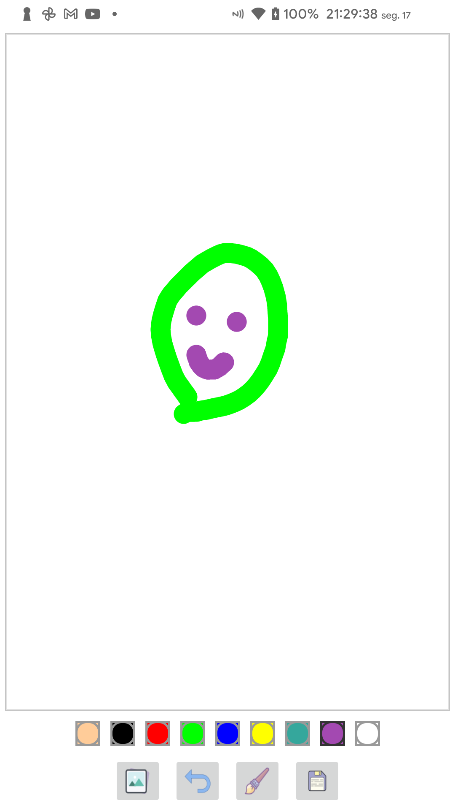
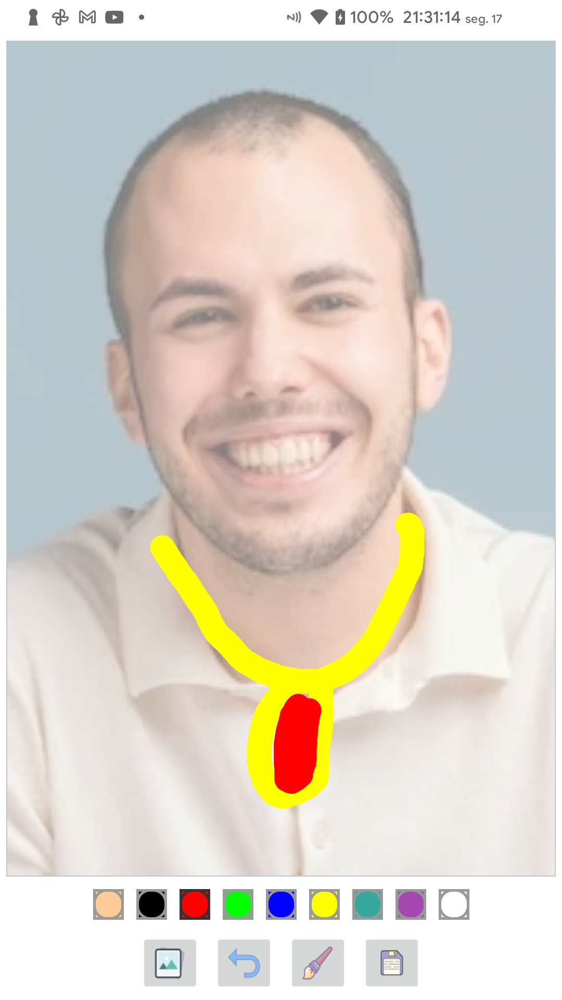
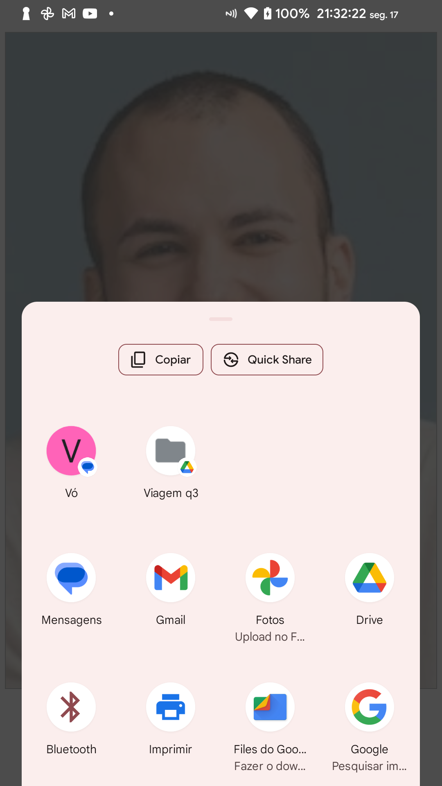

# DrawingApp
Aplicativo Android de desenho livre

## Objetivo
Desenhar em quadro vazio ou com imagem de fundo e compartilhar com outros apps

## Funcionalidades
- Desenhar no quadro
- Definir espessura do risco
- Definir cor do risco
- Salvar o desenho no dispositivo
- Compartilhar imagem do desenho com outros apps

## Linguagem
- Kotlin 
- XML

## Screenshots
  
